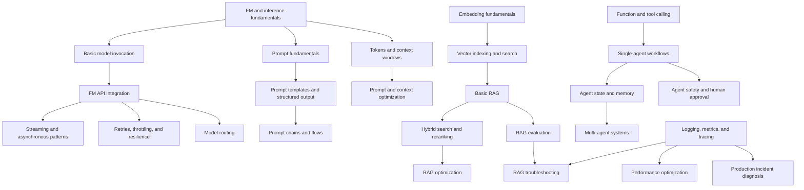
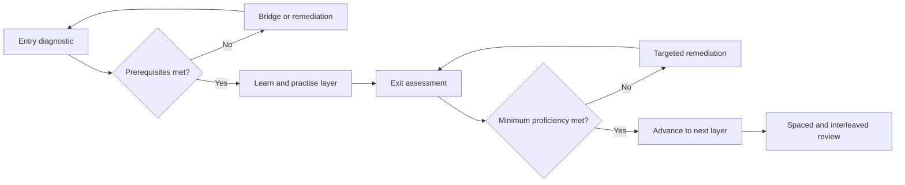
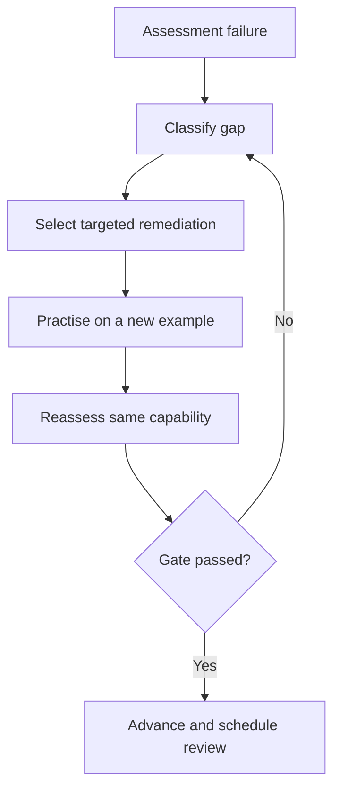

# AIP-C01 Teaching Strategy

## Purpose

This document defines the strategy for designing and delivering a practical preparation program for the **AWS Certified Generative AI Developer – Professional (AIP-C01)** exam.

It does **not** yet define the final ordered curriculum. Its purpose is to establish the rules and process by which that curriculum will be created, taught, assessed, and improved.

The strategy is based on:

- The detailed AIP-C01 syllabus in `ai-professional-combined.md`
- The skill-level analysis in `AIP-C01_Knowledge_Type_Classification.md`
- Supporting observations in `attached-syllabus-knowledge-types.md`

The intended outcome is not simply an exam-cram course. It is a **dependency-based, mastery-gated, adaptive learning program** in which:

1. Topics are placed in an effective learning order.
2. A learner must demonstrate minimum proficiency before progressing.
3. Each topic is taught using methods suited to the kind of knowledge involved.
4. Exam-style judgment is developed only after the required foundations are in place.
5. Gaps are remediated using targeted methods rather than generic repetition.

---

# 1. Core Design Principle

The strategy separates four decisions that must not be confused.

| Decision | Primary determinant |
|---|---|
| **What should be learned first?** | Prerequisites and dependency relationships |
| **How should it be taught?** | Knowledge type and where the knowledge resides |
| **How deeply should it be learned?** | Required proficiency, exam relevance, and downstream dependencies |
| **How should mastery be verified?** | The capability the learner must demonstrate |

The governing rule is:

> **Dependency determines sequence. Knowledge type determines pedagogy. Required capability determines assessment. Exam importance determines emphasis.**

Knowledge-type classification must **not** be used to decide the topic order.

For example:

- Embeddings must be understood before advanced vector retrieval because of dependency, not because both are conceptual.
- Tool calling must precede agentic orchestration because agents depend on reliable tool interfaces, not because both are procedural.
- Evaluation must be introduced early because later experimentation depends on measurement, even though evaluation appears in Domain 5 of the exam syllabus.
- Security, cost, observability, and governance should be introduced at a basic level early and deepened later because they are cross-cutting concerns.

---

# 2. Strategy Objectives

The teaching strategy must accomplish the following.

## 2.1 Establish an effective learning order

The official exam syllabus is an assessment specification. It is not assumed to be the ideal teaching sequence.

The curriculum must therefore be reconstructed around:

- Conceptual prerequisites
- Technical dependencies
- Increasing complexity
- Integration dependencies
- Required operational maturity
- Exam relevance

## 2.2 Prevent premature advancement

A learner should not progress merely because a lesson has been completed.

Each major layer must define:

- Entry requirements
- Expected learning outcomes
- Minimum proficiency
- Exit assessment
- Remediation path
- Progression decision

## 2.3 Match the teaching method to the topic

Different knowledge types require different learning methods.

Examples:

- Facts and service capabilities require retrieval and spaced review.
- Architecture concepts require diagrams, comparison, and explanation.
- Implementation skills require hands-on practice.
- Conditional judgment requires contrasting scenarios.
- Diagnostic competence requires broken systems and failure analysis.
- Governance requires policy, control, role, and accountability mapping.
- Embedded AWS knowledge requires interaction with real tools, APIs, and configurations.

## 2.4 Develop professional exam judgment

Professional-level questions often provide several technically plausible answers.

The learner must become able to:

- Identify the dominant requirement.
- Distinguish mandatory constraints from preferences.
- Compare alternatives.
- Recognize downstream effects.
- Select the least-risk or best-fit option.
- Explain why other options are less suitable.

## 2.5 Adapt to the learner

The program must support:

- Testing out of already-mastered material
- Additional foundation work when required
- Targeted remediation
- Different practice volume by topic
- Different learning methods for different gaps

---

# 3. Curriculum Design Architecture

The curriculum design process consists of six stages.

```mermaid
flowchart LR
    A[Inventory syllabus skills] --> B[Identify assumed foundations]
    B --> C[Build prerequisite and dependency graph]
    C --> D[Group skills into coherent learning units]
    D --> E[Derive ordered learning layers]
    E --> F[Assign proficiency gates]
    F --> G[Apply knowledge-type teaching methods]
    G --> H[Create assessments and remediation paths]
```

The order shown above is intentional.

The teaching method is selected **only after** the learning sequence and proficiency expectations are established.

---

# 4. Prerequisite and Dependency Graph

## 4.1 Purpose

The prerequisite graph is the primary mechanism for determining the learning order.

Each node represents a learnable capability, not necessarily one exam syllabus bullet.

Each edge means that one capability is required, or strongly advantageous, before another can be learned effectively.

## 4.2 Types of dependencies

| Dependency type | Meaning | Example |
|---|---|---|
| **Conceptual** | A later concept assumes understanding of an earlier concept | Vector retrieval depends on embeddings and similarity |
| **Procedural** | A later implementation requires an earlier implementation skill | Model routing depends on reliable model invocation |
| **Architectural** | A later system design composes earlier components | Enterprise RAG depends on ingestion, retrieval, model invocation, and security |
| **Diagnostic** | Troubleshooting requires understanding the normal system flow | RAG troubleshooting depends on understanding ingestion through generation |
| **Operational** | Optimization requires a working baseline and measurements | Cost optimization depends on token and usage visibility |
| **Governance** | Oversight requires understanding data, model, and workflow boundaries | AI governance depends on data flow, identities, logs, and ownership |
| **Cognitive-load** | An intermediate concept reduces the mental burden of advanced material | Single-agent workflows should precede multi-agent coordination |

## 4.3 Dependency rules

The graph should follow these rules:

1. A node must represent an observable capability.
2. An edge must have an explicit reason.
3. Dependencies should be marked as **hard** or **soft**.
4. Circular dependencies should be resolved through staged introduction.
5. Cross-cutting concerns may appear at multiple maturity levels.
6. The graph should remain traceable to all syllabus skills.

## 4.4 Hard and soft dependencies

### Hard dependency

A learner is unlikely to understand or perform the later capability without the earlier one.

Examples:

- Tokens and context windows before context optimization
- Embeddings before vector search
- Basic vector search before hybrid retrieval and reranking
- Model invocation before API resilience and routing
- Tool calling before autonomous agents
- Basic monitoring before production troubleshooting
- A working RAG system before RAG evaluation and diagnosis

### Soft dependency

The earlier knowledge improves learning or performance but is not an absolute requirement.

Examples:

- Advanced model benchmarking before simple model routing
- Deep governance design before basic guardrail configuration
- Containerized self-hosting before comparing managed and self-managed deployment
- Advanced multi-agent evaluation before basic multi-agent concepts

## 4.5 Illustrative dependency fragment

This is an example only, not the final curriculum graph.

---

# 5. Foundational Layer Outside the Official Syllabus Structure

## 5.1 Why it is required

The official syllabus distributes foundational concepts across multiple domains and assumes some prior understanding.

A prospective test taker may know AWS services without understanding the underlying GenAI mechanics, or may understand GenAI but lack AWS implementation knowledge.

A coherent foundation must therefore be created before the advanced syllabus-derived layers.

## 5.2 Proposed foundation categories

The exact scope will be finalized during curriculum planning.

### A. Foundation-model fundamentals

- What foundation models and LLMs do
- Inference versus training and customization
- Tokens and context windows
- Input and output modalities
- Determinism and probabilistic outputs
- Temperature, top-k, and top-p
- Latency, throughput, and token usage

### B. Prompt and interaction fundamentals

- System, developer, and user instructions
- Prompt structure
- Few-shot examples
- Structured outputs
- Conversation state
- Context management
- Basic prompt failure modes

### C. Embedding and retrieval fundamentals

- Embeddings
- Vector representations
- Similarity measures
- Indexing
- Metadata
- Semantic search
- Keyword search
- Basic RAG flow

### D. API and integration fundamentals

- Synchronous and asynchronous interaction
- Streaming
- Event-driven patterns
- Timeouts and retries
- Rate limits
- Idempotency
- Authentication and authorization
- Service boundaries

### E. AWS architecture foundation

- IAM fundamentals
- VPC and private connectivity basics
- Lambda, API Gateway, SQS, EventBridge, and Step Functions
- S3, DynamoDB, Aurora, and OpenSearch roles
- CloudWatch, CloudTrail, and X-Ray
- Basic CI/CD and infrastructure-as-code concepts

### F. Evaluation fundamentals

- What constitutes a good answer
- Relevance, accuracy, groundedness, consistency, and fluency
- Human evaluation
- Automated evaluation
- Golden datasets
- Baselines and regression testing
- Separating retrieval quality from generation quality

### G. Security, safety, and governance fundamentals

- Trust boundaries
- Least privilege
- Sensitive data and PII
- Prompt injection
- Output safety
- Grounding and hallucinations
- Auditability and lineage
- Human oversight

### H. Operational fundamentals

- Cost dimensions
- Latency decomposition
- Throughput and concurrency
- Caching
- Logging, metrics, and traces
- Service-level objectives
- Failure modes

## 5.3 Foundation design rule

Only concepts required by later AIP-C01 topics should be included.

The foundation should not become a general-purpose machine-learning or AWS course.

---

# 6. Diagnostic Starting Assessment

## 6.1 Purpose

The initial diagnostic determines whether the learner possesses the minimum capabilities needed to begin the planned progression.

It is not merely a mock exam.

A mock exam may reveal incorrect answers but often cannot distinguish whether the underlying problem is:

- Missing terminology
- Weak conceptual understanding
- Lack of implementation experience
- Poor scenario judgment
- Diagnostic weakness
- Missing AWS-specific embedded knowledge

## 6.2 Diagnostic dimensions

The starting assessment should measure at least:

| Dimension | What is measured |
|---|---|
| **GenAI fundamentals** | Models, tokens, inference, context, prompting |
| **Retrieval fundamentals** | Embeddings, vectors, semantic search, RAG |
| **AWS architecture** | Core services, IAM, integration, storage, observability |
| **Implementation readiness** | APIs, SDKs, events, workflows, basic coding |
| **Security and governance** | Data protection, access control, safety, auditability |
| **Operational reasoning** | Cost, latency, throughput, resilience, monitoring |
| **Architecture judgment** | Requirements, trade-offs, and pattern selection |
| **Diagnostic reasoning** | Ability to isolate causes from symptoms |

## 6.3 Diagnostic evidence

The diagnostic should use multiple forms of evidence:

1. Short factual questions
2. Concept explanation
3. Architecture reconstruction
4. Scenario decisions
5. Small implementation or configuration task
6. Troubleshooting exercise
7. Confidence rating for each response

This prevents a learner from passing solely through memorized terminology.

## 6.4 Diagnostic outcomes

The diagnostic can produce four outcomes for each capability:

| Result | Meaning | Action |
|---|---|---|
| **Mastered** | Meets or exceeds the required level | Test out or use only spaced review |
| **Ready** | Has the prerequisite foundation | Enter the planned learning unit |
| **Partial** | Has some knowledge but insufficient proficiency | Use a compressed bridge module |
| **Not ready** | Critical prerequisite is absent | Complete the full foundation module |

## 6.5 Diagnostic principles

- Test capabilities, not course completion.
- Do not average away a critical weakness.
- Confidence must be compared with correctness.
- High-confidence errors need special attention.
- Prior experience should reduce study time only when demonstrated.
- A strong conceptual score cannot substitute for a required implementation capability.
- A strong implementation score cannot substitute for security or governance awareness where these are prerequisites.

---

# 7. Mastery-Gated Progression

## 7.1 Learning layer structure

Every learning layer should have:

1. Defined prerequisites
2. Entry diagnostic
3. Ordered learning units
4. Minimum proficiency outcomes
5. Practice activities
6. Exit assessment
7. Remediation routes
8. Progression decision
9. Scheduled later review

## 7.2 Capability-based proficiency levels

| Level | Learner capability |
|---|---|
| **0 — Unfamiliar** | Does not recognize the concept or capability |
| **1 — Recognize** | Identifies terminology, service, or pattern |
| **2 — Explain** | Explains purpose, flow, and major relationships |
| **3 — Apply/Implement** | Uses or implements the capability in a standard situation |
| **4 — Select/Diagnose** | Chooses among alternatives and diagnoses common failures |
| **5 — Design/Defend** | Designs under constraints and defends trade-offs in unfamiliar situations |

The required exit level will differ by learning unit.

Examples:

| Topic | Likely minimum exit capability |
|---|---|
| Basic terminology | Recognize and explain |
| Model invocation | Implement |
| Model selection | Select and defend |
| Basic RAG | Implement and explain |
| RAG troubleshooting | Diagnose |
| Enterprise integration | Design and defend |
| Governance | Apply controls and assign accountability |
| Performance optimization | Measure, diagnose, and select |
| Exam scenario judgment | Select, eliminate, and defend |

## 7.3 Minimum proficiency gate

A layer should not be passed through a single averaged percentage.

The gate should combine relevant dimensions.

An illustrative gate might require:

- No hard-prerequisite capability below **Level 3**
- All critical security or safety capabilities at or above the required level
- Successful completion of the layer artifact
- Satisfactory performance on scenario questions
- Correct diagnosis of at least one realistic failure
- Acceptable confidence calibration

Exact thresholds will be set when the learning layers are defined.

## 7.4 Hard gates and soft gates

### Hard gate

The learner must remediate before moving forward.

Typical hard-gate areas:

- FM and token fundamentals
- Basic prompting
- Embeddings before vector retrieval
- Model invocation before advanced API patterns
- Tool interfaces before agent orchestration
- IAM and trust boundaries before enterprise integration
- Evaluation basics before optimization
- Observability basics before troubleshooting

### Soft gate

The learner may proceed, but the gap remains active in the review plan.

Typical soft-gate areas:

- Memorization of every service variation
- Less common deployment alternatives
- Advanced multimodal processing
- Specialized model-customization details
- Some advanced governance mechanisms
- Rare service-specific implementation variants

## 7.5 No false progression

The following should not count as mastery:

- Watching a demonstration
- Following a lab without understanding it
- Recognizing the correct answer after seeing it
- Completing multiple-choice questions through test-taking clues
- Memorizing one architecture diagram
- Repeating a procedure without being able to adapt it
- Obtaining a working result without explaining why it works
- Producing an answer without identifying its risks or limitations

---

# 8. Creating Coherent Learning Units

## 8.1 Do not create 98 isolated lessons

The syllabus contains 98 skills, but many are:

- Variations of one capability
- Extensions of a common architecture
- Operational applications of earlier concepts
- Different AWS implementations of one pattern
- Advanced maturity stages of a foundational skill

The curriculum should group them into coherent learning units while retaining traceability.

A likely final curriculum may contain approximately **25–35 learning units**, though the exact number should emerge from the dependency analysis.

## 8.2 Learning-unit formation rules

A learning unit should:

- Have a coherent capability outcome
- Have a manageable set of prerequisites
- Produce an observable artifact
- Be assessable
- Map to one or more syllabus skills
- Avoid combining unrelated cognitive tasks
- Remain small enough for targeted remediation

## 8.3 Learning-unit specification

Each unit should contain the following metadata.

| Field | Purpose |
|---|---|
| **Unit ID and title** | Stable curriculum reference |
| **Capability statement** | What the learner will be able to do |
| **Syllabus mapping** | AIP-C01 skills covered |
| **Prerequisites** | Required earlier capabilities |
| **Dependency strength** | Hard or soft |
| **Learning layer** | Position in progression |
| **Target proficiency** | Recognize, explain, implement, select, diagnose, or design |
| **Primary knowledge types** | Declarative, conceptual, procedural, conditional, causal, strategic, normative |
| **Knowledge locus** | Explicit, embedded, tacit, implicit, collective/institutional |
| **Teaching method** | Selected after sequencing |
| **Practice artifact** | Observable learner output |
| **Assessment** | Evidence of mastery |
| **Gate status** | Whether failure blocks progression |
| **Remediation path** | Targeted corrective action |
| **Review points** | Later spaced and interleaved review |
| **Exam relevance** | Priority and expected question style |

---

# 9. Applying Knowledge Classification After Ordering

Once the ordered learning units are established, the classifications in `AIP-C01_Knowledge_Type_Classification.md` will be used to choose teaching and assessment methods.

The supporting research in `attached-syllabus-knowledge-types.md` contributes useful secondary dimensions, particularly:

- Embedded knowledge
- Institutional and organizational knowledge
- Domain-specific knowledge
- Expert maturity
- Metacognitive reflection

These are treated as parallel dimensions rather than as one flat taxonomy.

## 9.1 Cognitive knowledge types

| Knowledge type | Best teaching methods | Best evidence of mastery |
|---|---|---|
| **Declarative** | Retrieval practice, concise notes, spaced repetition | Recall without reference material |
| **Conceptual** | Architecture diagrams, comparison, self-explanation | Reconstruct and explain relationships |
| **Procedural** | Demonstration, guided lab, independent lab | Complete the task without step-by-step instructions |
| **Conditional** | Contrasting cases, scenario questions | Select the correct method and reject alternatives |
| **Causal/diagnostic** | Controlled experiments, failure injection | Predict effects and identify root causes |
| **Strategic** | Open-ended design cases, architecture reviews | Defend trade-offs under competing constraints |
| **Normative/ethical** | Risk cases, policy mapping, governance discussion | Justify controls, oversight, and acceptable behavior |
| **Metacognitive** | Confidence logs, error journals, reasoning review | Identify and correct recurring learning or reasoning errors |

## 9.2 Knowledge representation and locus

| Type | Meaning | Suitable learning methods |
|---|---|---|
| **Explicit** | Codified in documents, diagrams, procedures, and policies | Documentation review and retrieval |
| **Embedded** | Encoded in tools, APIs, configurations, and services | Console, CLI, SDK, and API practice |
| **Tacit** | Judgment difficult to fully describe | Repeated cases, expert comparison, postmortems |
| **Implicit** | Automatic pattern recognition or habitual checks | Repeated mixed practice |
| **Collective/institutional** | Distributed across roles, policies, processes, and systems | Operating-model cases, responsibility mapping, simulated reviews |

## 9.3 Example of combined treatment

Consider a learning unit on resilient FM API integration.

- **Order:** After basic model invocation and API integration
- **Target capability:** Implement and diagnose
- **Knowledge types:** Procedural, causal, conditional
- **Knowledge locus:** Explicit and embedded, progressing toward tacit
- **Teaching method:** Brief model, implementation lab, failure injection
- **Assessment:** Configure retries and throttling protection, then diagnose a retry storm
- **Gate:** Hard if later model routing and enterprise integration depend on it

The order came from dependency analysis. The method came from knowledge classification.

---

# 10. Teaching Progression Within a Learning Unit

A learning unit should not necessarily use the same internal progression, but the following pattern is a useful default.

## 10.1 Concept introduction

- Define the capability.
- Explain why it exists.
- Show where it belongs in the larger architecture.
- Identify prerequisites and constraints.

## 10.2 Worked example

- Demonstrate a correct implementation or decision.
- Make the reasoning visible.
- Point out signals that determine the choice.

## 10.3 Guided practice

- Learner performs the capability with scaffolding.
- Immediate feedback is provided.
- Common errors are deliberately surfaced.

## 10.4 Independent practice

- Scaffolding is removed.
- The context is varied.
- The learner must adapt rather than copy.

## 10.5 Assessment

- Assessment matches the target capability.
- New surface details are used to prevent memorized reproduction.
- The learner explains the reasoning where appropriate.

## 10.6 Reflection and encoding

- Record errors and causes.
- Extract reusable decision rules.
- Add only suitable facts to spaced repetition.
- Schedule later interleaved review.

This full pattern should not be applied mechanically to every topic. For a small declarative item, retrieval practice may be sufficient. For strategic or diagnostic topics, multiple cases may be required.

---

# 11. Spiral Curriculum

## 11.1 Why the curriculum cannot be purely linear

Many AIP-C01 capabilities mature through repeated encounters.

For example, prompt engineering may progress through:

1. Basic prompts
2. Structured outputs
3. Prompt templates
4. Prompt chains
5. Prompt governance
6. Prompt evaluation
7. Prompt optimization
8. Prompt troubleshooting

Similarly, security may progress through:

1. IAM and trust boundaries
2. Protected model invocation
3. Data privacy
4. Guardrails
5. Prompt-injection defenses
6. Enterprise governance
7. Continuous monitoring and audit

## 11.2 Spiral principle

A topic may reappear when:

- A more advanced dependency becomes available
- It must be integrated with another subsystem
- Operational concerns become relevant
- Evaluation can be added
- Security or governance maturity must increase
- Exam-level trade-off reasoning becomes possible

## 11.3 Cross-cutting threads

The following should be introduced early and deepened throughout:

- Evaluation
- Security and privacy
- Cost
- Observability
- Reliability
- Governance
- Responsible AI

They should not be postponed to their official domain position.

---

# 12. Reference Application Strategy

## 12.1 Purpose

The program should use one evolving reference application to prevent the course from becoming a collection of disconnected labs.

A recommended primary reference application is an:

> **Enterprise knowledge assistant using RAG, controlled tool access, human oversight, governance, evaluation, and production observability.**

## 12.2 Evolution of the application

The application can grow through the curriculum:

1. Basic FM invocation
2. Prompt construction
3. Structured response
4. Streaming API
5. Document ingestion
6. Embedding generation
7. Vector retrieval
8. Basic RAG
9. Metadata filtering
10. Hybrid retrieval
11. Reranking
12. Conversation state
13. Tool calling
14. Single-agent orchestration
15. Human approval
16. Multi-model routing
17. Guardrails and PII protection
18. Evaluation harness
19. Cost and latency measurements
20. Monitoring and tracing
21. CI/CD and rollback
22. Failure injection and troubleshooting
23. Governance evidence and audit trail

## 12.3 Secondary use cases

One or more smaller cases may be needed for capabilities not naturally covered by the primary application, such as:

- Multimodal processing
- Model customization
- Batch inference
- Edge or hybrid deployment
- Specialized regulated-industry scenarios

---

# 13. Assessment Architecture

## 13.1 Four assessment levels

### A. Entry diagnostic

Determines whether the learner can enter a layer.

### B. Formative assessment

Provides feedback during learning.

Examples:

- Retrieval checks
- Diagram reconstruction
- Lab checkpoints
- Short scenario decisions
- Prediction before execution

### C. Layer-exit assessment

Determines whether the learner has achieved the minimum proficiency required to proceed.

### D. Integrated exam-readiness assessment

Measures cross-domain scenario judgment after the required foundations and integrations are established.

## 13.2 Assessment alignment

| Target capability | Appropriate assessment |
|---|---|
| Recognize | Identification or recall |
| Explain | Written or verbal explanation |
| Implement | Independent lab |
| Select | Contrasting scenario |
| Diagnose | Broken-system exercise |
| Design | Open-ended architecture case |
| Govern | Control, role, evidence, and escalation mapping |
| Optimize | Baseline measurement followed by justified improvement |

## 13.3 Scenario assessment design

A professional-level scenario should contain:

- Business objective
- Technical environment
- Constraints
- Risk or compliance considerations
- Scale or performance requirements
- Multiple plausible options
- One dominant or best-balanced answer

The learner should be asked to:

1. Identify the dominant requirements.
2. Select an option.
3. Explain the selection.
4. Explain why alternatives are weaker.
5. Identify residual risks.

## 13.4 Assessment evidence repository

The learner should retain artifacts such as:

- Architecture diagrams
- Decision records
- Working code
- Configuration files
- Prompt versions
- Evaluation reports
- Trace and log analyses
- Cost comparisons
- Incident postmortems
- Governance mappings
- Error and confidence logs

These artifacts provide stronger evidence than completion percentages.

---

# 14. Remediation Strategy

## 14.1 Remediation must match the gap

A learner should not be told simply to “review the topic.”

| Gap type | Typical evidence | Remediation |
|---|---|---|
| **Declarative** | Does not know feature or term | Targeted documentation and retrieval cards |
| **Conceptual** | Cannot explain relationships | Redraw architecture; compare with counterexamples |
| **Procedural** | Cannot perform task independently | Repeat lab with progressively reduced scaffolding |
| **Conditional** | Chooses wrong method | Contrasting scenarios and decision tables |
| **Causal** | Treats symptoms as causes | Controlled experiment and failure analysis |
| **Strategic** | Ignores competing constraints | Architecture review and trade-off defence |
| **Normative** | Misses privacy, safety, or accountability | Risk case and policy-to-control mapping |
| **Embedded** | Knows idea but not AWS realization | Console, CLI, SDK, or configuration exercise |
| **Tacit** | Fails unfamiliar cases despite knowledge | Varied cases, expert comparison, postmortems |
| **Metacognitive** | Repeats same reasoning error | Confidence calibration and error-pattern review |

## 14.2 Remediation loop

## 14.3 Avoiding over-remediation

The learner should remediate the failed capability, not automatically repeat an entire layer.

A full-layer repeat is justified only when:

- Several core capabilities are below threshold
- The learner cannot connect the components
- High-confidence misconceptions are widespread
- The final artifact demonstrates systemic misunderstanding

---

# 15. Spacing, Interleaving, and Retention

## 15.1 Spaced review

Declarative and explicit knowledge should be reviewed at increasing intervals.

Examples:

- AWS service capabilities
- Terminology
- Model parameters
- Evaluation metrics
- Security controls
- Failure-mode signatures

## 15.2 Interleaving

After initial competence is established, practice should mix related capabilities.

Examples:

- RAG + privacy + latency
- Agents + tool authorization + human approval
- Model routing + cost + resilience
- Prompt changes + evaluation + regression
- Vector-store design + metadata security + synchronization
- Deployment + monitoring + rollback

Interleaving develops conditional and strategic knowledge.

## 15.3 Cumulative review

Each layer-exit assessment should include a limited number of earlier prerequisite capabilities.

This prevents apparent progression built on forgotten foundations.

---

# 16. Exam Weighting and Prioritization

## 16.1 Weighting does not determine initial sequence

A high-weight domain is not automatically taught first.

Prerequisites remain the primary ordering mechanism.

## 16.2 Weighting affects emphasis

Exam weighting should influence:

- Depth
- Practice volume
- Scenario frequency
- Review frequency
- Capstone coverage
- Mock-exam representation

## 16.3 Dependency centrality also affects emphasis

A topic may deserve substantial attention even if it is not heavily weighted directly, because many later topics depend on it.

Examples may include:

- Tokens and context
- Model invocation
- IAM and trust boundaries
- Evaluation fundamentals
- Logging and tracing
- Embeddings and basic retrieval

---

# 17. Progress Tracking

## 17.1 Track capabilities, not chapters

The learner record should track:

- Current proficiency level
- Required proficiency level
- Evidence
- Last assessed date
- Confidence
- Active gaps
- Remediation status
- Next review date
- Downstream units blocked

## 17.2 Example progress record

| Capability | Required | Current | Evidence | Status |
|---|---:|---:|---|---|
| Explain token and context behavior | 2 | 3 | Concept explanation | Passed |
| Implement basic Bedrock invocation | 3 | 2 | Guided lab only | Remediate |
| Select sync vs async integration | 4 | 3 | Scenario set | Partial |
| Diagnose RAG retrieval failure | 4 | 1 | Not yet attempted | Blocked |

## 17.3 Confidence calibration

For assessed responses, the learner should record confidence.

The combination of correctness and confidence provides useful signals:

| Result | Interpretation |
|---|---|
| Correct, high confidence | Stable competence |
| Correct, low confidence | Knowledge may be fragile |
| Incorrect, low confidence | Recognized gap |
| Incorrect, high confidence | Misconception requiring priority remediation |

---

# 18. Curriculum Construction Process

The next phase should follow this process.

## Step 1: Normalize the syllabus

Convert all 98 skills into concise capability statements.

## Step 2: Identify assumed foundations

Add required capabilities not coherently organized in the official syllabus.

## Step 3: Build the dependency graph

Identify hard and soft dependencies among all capabilities.

## Step 4: Identify foundational and central nodes

Find capabilities that unlock large portions of the graph.

## Step 5: Cluster into learning units

Group closely related capabilities while preserving traceability.

## Step 6: Derive learning layers

Create an ordered progression based on the graph.

## Step 7: Define minimum proficiency

Set entry and exit requirements for each layer and unit.

## Step 8: Validate the order

Check for:

- Missing prerequisites
- Excessive cognitive load
- Premature integration
- Delayed cross-cutting concerns
- Orphan syllabus skills
- Unnecessary repetition

## Step 9: Freeze the progression

The topic order should be reviewed and agreed upon before detailed lesson design.

## Step 10: Apply the knowledge framework

Use the knowledge classifications to assign:

- Teaching method
- Practice type
- Assessment
- Remediation

## Step 11: Build learning and assessment assets

Create:

- Lessons
- Diagrams
- Labs
- Scenario questions
- Failure exercises
- Evaluation datasets
- Rubrics
- Progress records

## Step 12: Pilot and refine

Use learner evidence to identify:

- Incorrect dependencies
- Gates that are too weak or too strong
- Missing foundations
- Ineffective teaching methods
- Assessment blind spots

---

# 19. Deliverables

The full AIP-C01 teaching system should eventually include the following documents and assets.

## 19.1 Strategy deliverables

- Teaching strategy
- Curriculum design principles
- Knowledge-type framework
- Mastery and assessment model

## 19.2 Planning deliverables

- Normalized capability inventory
- Prerequisite and dependency graph
- Foundation-layer definition
- Ordered learning layers
- Learning-unit catalog
- Syllabus traceability matrix
- Proficiency and gate matrix

## 19.3 Teaching deliverables

- Topic lessons
- Architecture diagrams
- Labs
- Reference application
- Scenario exercises
- Governance cases
- Failure-injection exercises
- Spaced-retrieval material

## 19.4 Assessment deliverables

- Initial diagnostic
- Layer-entry assessments
- Layer-exit assessments
- Rubrics
- Remediation guides
- Mixed-domain mock exams
- Confidence and error logs

## 19.5 Tracking deliverables

- Learner capability profile
- Progress dashboard or tracker
- Evidence repository
- Review schedule
- Blocked-dependency report

---

# 20. Quality Criteria

The strategy and resulting curriculum should be evaluated against the following criteria.

## 20.1 Completeness

- Every syllabus skill is mapped.
- Required assumed foundations are included.
- Cross-cutting concerns are represented.

## 20.2 Dependency correctness

- No advanced unit assumes an untaught capability.
- Hard prerequisites are explicit.
- The sequence minimizes unnecessary cognitive load.

## 20.3 Pedagogical fit

- Teaching methods match knowledge types.
- Assessment matches target capability.
- Embedded knowledge uses real AWS interaction.
- Strategic knowledge uses trade-off scenarios.
- Diagnostic knowledge uses failures, not only questions.

## 20.4 Mastery integrity

- Learners cannot pass through attendance or familiarity.
- Critical capabilities cannot be averaged away.
- Exit gates protect later learning.
- Remediation is targeted and reassessed.

## 20.5 Exam relevance

- The program develops professional scenario judgment.
- AWS-specific services and patterns are covered.
- Exam weighting influences practice volume.
- Learners practise eliminating plausible alternatives.

## 20.6 Practical relevance

- Learners create working artifacts.
- Security, governance, cost, and observability are integrated.
- The reference application resembles a production system.
- Troubleshooting and rollback are included.

---

# 21. Decisions Already Established

The following strategy decisions are considered established:

1. The official domain order will not automatically become the teaching order.
2. The teaching order will be derived from prerequisites and dependencies.
3. A coherent foundational layer will be added where the syllabus assumes knowledge.
4. An initial diagnostic assessment will determine learner readiness.
5. Every major learning layer will have a minimum proficiency gate.
6. Hard and soft gates will be distinguished.
7. Knowledge classification will be applied only after the ordered progression is finalized.
8. Teaching and assessment methods will vary by knowledge type.
9. Skills will be grouped into coherent learning units rather than taught as 98 isolated lessons.
10. Security, evaluation, cost, governance, and observability will be introduced early and deepened later.
11. The curriculum will be spiral and cumulative rather than one-pass linear.
12. One evolving reference application will connect the learning units.
13. Remediation will be targeted according to the type of gap.
14. Exam weighting will affect emphasis, not prerequisite order.
15. Progress will be based on demonstrated capability, not content completion.

---

# 22. Immediate Next Step

The next activity is to build the **AIP-C01 normalized capability inventory and prerequisite/dependency graph**.

That activity should:

1. Include the 98 syllabus skills.
2. Add the necessary foundation capabilities.
3. Identify hard and soft dependencies.
4. Group related capabilities provisionally.
5. Highlight central prerequisite nodes.
6. Produce the first candidate ordered learning progression.
7. Avoid assigning detailed teaching methods until the order is reviewed and finalized.

Only after that progression is accepted should the knowledge-type classification be applied to create the detailed teaching plan.

---

# Summary

The AIP-C01 program will be designed as an **adaptive, dependency-based, mastery-gated teaching system**.

Its operating sequence is:

> **Identify prerequisites → build dependency graph → create ordered learning layers → define proficiency gates → assess readiness → teach using knowledge-appropriate methods → reassess → remediate or progress → revisit through spacing and interleaving.**

The strategy aims to ensure that learners do not merely recognize AWS and GenAI terminology. They should be able to explain, implement, select, diagnose, integrate, optimize, govern, and defend AIP-C01 solutions at the level required by a professional exam.
