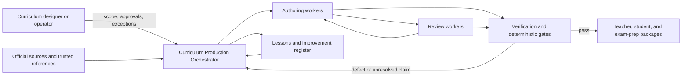
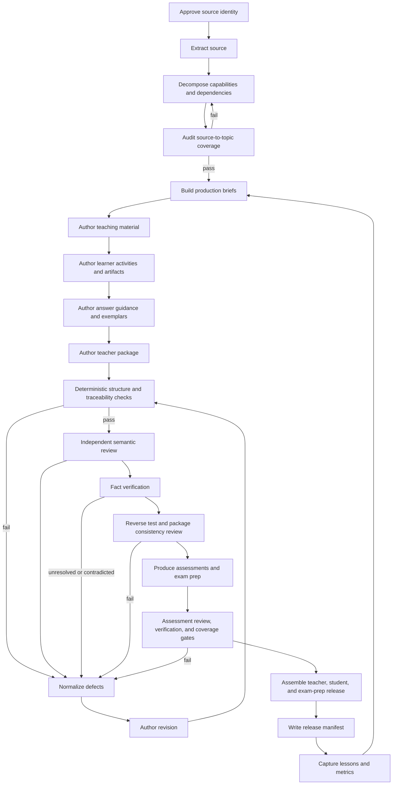

# Curriculum Production Agent Architecture

## Purpose

This document defines the project-level architecture for producing a complete,
reviewed teaching system from approved source material.

The system coordinates the full chain:

```text
source identity
  -> source extraction
  -> decomposition and learning order
  -> curriculum map
  -> teaching material
  -> learner activities and artifacts
  -> answer guidance and exemplars
  -> assessment and exam preparation
  -> review, fact checking, remediation, and release
  -> lessons learned and prompt/process improvement
```

The architecture uses one deterministic **Curriculum Production Orchestrator**
to coordinate specialized worker agents. Worker agents may use different LLMs,
tools, or humans, but no worker declares its own output production-complete.

Pilot1 AIP-C01 is the reference implementation. The architecture itself is
subject-agnostic.

## Governing Principles

1. Source identity and extraction precede decomposition.
2. Dependency order precedes material generation.
3. Knowledge type determines teaching and artifact form.
4. Teaching precedes the activity that depends on it.
5. Answer guidance and exemplars accompany learner practice.
6. Assessment follows taught capability and routes misses to real remediation.
7. Author and reviewer should be independent enough to reduce correlated error.
8. Deterministic gates, not an LLM's confidence, decide workflow status.
9. Raw generation is evidence, not approved curriculum.
10. Review findings must improve the next authoring pass.
11. Factual claims require source evidence at the appropriate risk level.
12. Completion means the entire traceability chain passes, not merely that
    files exist.

## System Context



## Architectural Style

The system is a hierarchical multi-agent workflow:

- one orchestrator owns workflow state, sequencing, budgets, gates, logs, and
  release status;
- worker agents perform bounded semantic tasks;
- deterministic services parse, compare, count, validate, and enforce;
- human reviewers resolve high-risk ambiguity and approve explicit exceptions;
- durable artifacts and machine-readable manifests carry state between steps.

The orchestrator should be code, not a long conversational prompt. It may call
LLMs, local scripts, source tools, and human review interfaces, but it must
persist state outside model context.

## Major Components

### 1. Curriculum Production Orchestrator

The orchestrator coordinates one project, route, day, module, or learning unit.

Responsibilities:

- load the project manifest and requested production scope;
- validate upstream prerequisites before starting a stage;
- create immutable run and artifact identifiers;
- select author, reviewer, and verifier adapters;
- invoke workers in the required order;
- preserve prompts, raw responses, reviewed revisions, and provenance;
- run deterministic gates after each stage;
- stop on blockers rather than generating around missing inputs;
- manage bounded revision and top-up loops;
- enforce token/API and human-review budgets;
- emit progress events and heartbeat logs;
- request human decisions where policy requires them;
- write the final release manifest and improvement report.

The orchestrator never silently changes an official objective, curriculum
mapping, knowledge type, or approved source.

### 2. Source Foundation Subsystem

This subsystem owns Layers `-2`, `-1`, and `0`.

| Layer | Worker or service | Output |
|---:|---|---|
| `-2` | Source Identity Agent and human confirmer | Approved source identity checkpoint |
| `-1` | Source Extraction Agent | Faithful text, structured objectives, extraction metadata |
| `0` | Decomposition Coverage Auditor | Source-to-topic matrix, deferrals, coverage verdict |

The source layer is authoritative for official wording. Downstream workers
consume its structured output rather than re-extracting or paraphrasing the
source independently.

### 3. Curriculum Architecture Subsystem

This subsystem converts approved objectives into a defensible teaching plan.

Workers:

- **Capability Decomposer:** converts source objectives into observable
  capabilities while preserving source IDs.
- **Dependency Architect:** identifies hard and soft prerequisites and derives
  learning order.
- **Unit Designer:** groups capabilities into coherent learning units.
- **Knowledge Profiler:** assigns dominant and secondary knowledge types.
- **Artifact Planner:** derives required learner evidence from the knowledge
  profile.
- **Pacing Planner:** places units into supported routes without lowering
  mastery standards.
- **Traceability Auditor:** confirms every source objective and curriculum
  topic is represented or explicitly deferred.

Output:

```text
source objective
  -> capability
  -> dependency position
  -> curriculum unit/topic
  -> knowledge profile
  -> required artifact and mastery evidence
```

### 4. Production Brief Builder

Before prose or worksheets are generated, this worker creates one authoritative
production brief per learning unit or topic.

Required brief fields:

- stable unit and curriculum-order IDs;
- official source objectives;
- purpose and learner outcome;
- prerequisites and forward references;
- dominant and secondary knowledge types;
- required teaching methods;
- required learner artifact;
- assessment and remediation contract;
- trusted sources and source-sensitive claims;
- depth expectation and time budget;
- related day/module package;
- approved exemplars and known failure patterns;
- required output files and schemas.

All downstream workers receive the same brief. A worker cannot invent its own
scope or objective mapping.

### 5. Teaching Material Author

Produces learner-facing exposition before dependent activities are authored.

Typical outputs:

- study-guide sections;
- conceptual models and diagrams;
- definitions and comparison tables;
- procedures and configuration examples;
- weak-versus-strong examples;
- causal explanations and failure models;
- decision frameworks and tradeoffs;
- source notes and forward references.

The author must include actual teaching, not instructions telling another
author what to teach.

### 6. Learner Activity And Artifact Author

Produces practice in the form required by the knowledge profile.

Examples:

| Knowledge need | Typical output |
|---|---|
| Declarative | Retrieval cards, recall sheets |
| Conceptual | Concept maps, explanation prompts |
| Procedural or embedded | Labs, runbooks, configuration inspections |
| Conditional or strategic | Decision tables, ADRs, tradeoff matrices |
| Causal or diagnostic | Predict-observe-explain, incident analysis |
| Normative or institutional | Risk reviews, policy-control maps, RACI |
| Metacognitive | Error logs, confidence calibration |

Activities may only ask for capabilities taught in the study material or
clearly labeled as prerequisites or forward references.

### 7. Answer Guidance And Exemplar Author

Produces the feedback layer required for self-study and instructor calibration.

Outputs:

- worked and partially worked exemplars;
- answer guidance;
- rubrics and "what strong evidence looks like";
- common wrong approaches and misconceptions;
- gap-specific remediation;
- reassessment instructions.

Every substantial learner artifact needs enough guidance to distinguish weak,
adequate, and strong work without relying on the learner to be their own
un-calibrated examiner.

### 8. Teacher Package Author

Produces instructor-facing material from the approved student learning design.

Outputs may include:

- facilitator sequence and preparation;
- demonstrations and think-alouds;
- likely learner responses;
- questioning and coaching prompts;
- timing and adaptation guidance;
- assessment administration;
- remediation playbooks;
- source and risk notes.

Teacher material must not contradict or substitute for the student package.

### 9. Assessment Production Subsystem

Produces mastery checks and, where relevant, exam-preparation material.

It includes:

- artifact rubrics and exit checks;
- diagnostic and reassessment tasks;
- scenario and performance assessments;
- question-generation prompts;
- raw and reviewed question banks;
- timed quizzes and simulated exams;
- scoring, error analysis, and remediation routing.

The existing
[Exam Prep Production Agent Architecture](../Pilot1/aip-c01/exam-prep/exam-prep-agent-architecture.md)
is the Pilot1 implementation of the exam-preparation branch of this subsystem.

Assessment production starts only after its teaching substrate exists and
passes the reverse test.

### 10. Independent Review Subsystem

The reviewer is critically independent without being performatively
adversarial.

Recommended provider arrangement:

```text
Author adapter: Codex
Review adapter: Claude Code
```

This is a deployment choice, not a permanent architectural dependency.

Reviewer instructions:

- inspect source and files directly;
- find material gaps rather than stylistic differences;
- do not approve polished but unsupported work;
- do not invent defects merely to appear rigorous;
- cite exact evidence for every finding;
- distinguish blocker, required improvement, and optional refinement;
- state explicit passes as well as failures;
- propose concrete, bounded corrections;
- declare review limits and sampled scope.

Review roles:

- **Curriculum Alignment Reviewer:** source, dependency, map, and
  knowledge-profile conformance.
- **Teaching Depth Reviewer:** sufficiency, explanations, examples, and
  evenness above the minimum bar.
- **Reverse-Test Reviewer:** attempts every activity using only the prescribed
  teaching and guidance.
- **Artifact And Guidance Reviewer:** method fit, exemplar quality, rubric, and
  remediation.
- **Technical Fact Reviewer:** source-sensitive claim identification and
  verification.
- **Assessment Reviewer:** objective alignment, quality, distribution,
  duplicate resistance, and remediation routing.
- **Package Consistency Reviewer:** links, identifiers, terminology, scenario,
  and cross-file contradictions.

One reviewer model may perform several roles in separate passes. The passes
must remain separately logged so a broad "reviewed" label does not hide which
checks actually ran.

### 11. Feedback Normalizer

Converts free-form review into structured defects.

Minimum defect schema:

```text
finding_id
artifact
location
severity
requirement
evidence
learner_or_teacher_impact
required_change
verification_method
status
reviewer
review_run_id
```

The normalizer also records:

- explicit passes;
- review limitations;
- disputed findings;
- incorrect or overstated findings;
- recurring failure categories;
- prompt and process improvement signals.

### 12. Revision Worker

Receives only normalized findings relevant to its owned artifact.

Rules:

- preserve unrelated approved content;
- address blocker and required findings;
- explain any rejected reviewer recommendation;
- never mark its own finding resolved;
- return changed files and a concise resolution map;
- send revised artifacts through deterministic checks and independent review.

Revision loops are bounded. Persistent disagreement or factual uncertainty
escalates to a human rather than producing endless model debate.

### 13. Fact Verification Subsystem

Fact checking is separate from editorial review.

Responsibilities:

- extract material claims from teaching, examples, answer guidance,
  assessments, rationales, and remediation;
- classify claims by factual risk and temporal sensitivity;
- retrieve or open trusted sources;
- write claim-level evidence;
- mark each claim supported, contradicted, unresolved, or not source-sensitive;
- block release on unresolved high-risk claims.

Source presence is not claim verification. A service name appearing in a
trusted document does not prove the item's precise claim.

### 14. Deterministic Gate Engine

The gate engine performs checks that should not depend on LLM judgment.

Examples:

- required files and sections;
- schema and controlled vocabulary;
- stable IDs and provenance;
- source-to-topic and topic-to-artifact traceability;
- link and remediation-target existence;
- activity-to-teaching coverage records;
- missing exemplars;
- review blocker status;
- claim-verification status;
- question-bank topic and skill coverage;
- duplicate and stale-pattern checks;
- assessment distribution and answer-position balance;
- package manifest reconciliation;
- iteration and budget limits.

Every reported metric must be either enforced or labeled advisory.

### 15. Package Assembler And Release Manager

Assembles only passed artifacts into release views.

Package families:

- curriculum model;
- Student Kit;
- Teacher Kit;
- assessment and remediation package;
- exam-preparation package;
- source and traceability package;
- review and verification evidence;
- release manifest.

The release manager labels partial work honestly:

```text
draft
review-ready
blocked
approved slice
production complete
retired
```

It never promotes a package because a scheduled date arrived or an authoring
worker finished.

### 16. Continuous Improvement Subsystem

Continuous improvement closes both local and project-level loops.

Inputs:

- review findings and disputed findings;
- reverse-test failures;
- fact-check contradictions;
- assessment culls;
- learner errors and remediation outcomes;
- cost, latency, and iteration telemetry;
- human overrides;
- production incidents and stale-source discoveries.

Outputs:

- topic-specific authoring feedback;
- updated prompts and examples;
- deterministic rules and regression tests;
- source watchlists;
- revised architecture-kit guidance;
- lessons-learned entries;
- decision records for architectural changes.

Improvement must occur at the correct level:

```text
item defect -> item or prompt correction
topic pattern -> topic brief or teaching method correction
day/package pattern -> workflow or gate correction
cross-project pattern -> Curriculum Architecture Kit update
architecture change -> decision record
```

## End-To-End Workflow



## Required Production Sequence

The default sequence is:

1. confirm source identity;
2. extract official objectives faithfully;
3. decompose capabilities and prerequisites;
4. audit source-to-topic coverage;
5. build production briefs;
6. author study material;
7. author learner activities and artifacts;
8. author answer guidance and exemplars;
9. author teacher support;
10. run deterministic checks;
11. run independent review;
12. normalize findings and revise;
13. run factual verification;
14. run reverse and forward sufficiency tests;
15. produce assessment and exam-prep artifacts;
16. run assessment-specific review and gates;
17. assemble and release;
18. update lessons, prompts, tests, and decision records.

A stage may return to an earlier stage. It may not skip a required dependency
merely because a later worker can generate a plausible-looking file.

## Workflow State Model

Each artifact has an independent state:

```text
planned
  -> raw-authored
  -> normalized
  -> deterministic-check-passed
  -> review-ready
  -> revision-required | fact-check-required
  -> review-passed
  -> verified
  -> release-approved
```

Package status is the minimum status of its required artifacts and gates. A
package cannot be `production complete` while one required artifact is blocked
or unverified.

## Author And Reviewer Separation

The recommended first deployment uses:

| Role | Adapter |
|---|---|
| Teaching, artifact, guidance, and revision author | Codex |
| Independent semantic reviewer | Claude Code |
| Deterministic checks and orchestration | Local project scripts |
| Source-sensitive residual approval | Human reviewer or independently sourced verifier |

Safeguards:

- the reviewer receives source, specification, production brief, and authored
  files, not the author's hidden reasoning;
- the reviewer cannot directly overwrite approved artifacts;
- review output is stored verbatim before normalization;
- the author receives normalized findings and evidence;
- the author cannot close findings;
- the reviewer verifies resolutions in a later pass;
- deterministic gates run before and after semantic review;
- provider names are configurable in the project manifest.

## Human Control Points

Human input is required or recommended:

- approve source identity and disputed source scope;
- approve intentional objective deferrals;
- approve significant curriculum-map changes;
- resolve repeated author-review disagreement;
- resolve high-risk factual uncertainty;
- approve budget overages;
- accept consciously incomplete releases;
- approve final production release for high-stakes learner material.

## Quality Gates

### Upstream Gates

| Gate | Pass condition |
|---|---|
| Source identity | Correct source, authority, version, and snapshot are approved. |
| Extraction fidelity | Structured and human-readable extracts reconcile with the source. |
| Decomposition coverage | Every source objective is mapped or explicitly deferred. |
| Dependency and map integrity | Learning order, knowledge profile, and artifacts are explainable and traceable. |

### Teaching Package Gates

| Gate | Pass condition |
|---|---|
| Teaching completeness | Every required topic has actual exposition and examples. |
| Knowledge-method alignment | Teaching and activity forms match dominant and secondary knowledge types. |
| Reverse test | Every activity can be completed from prescribed teaching, prerequisites, and guidance. |
| Exemplar and guidance | Every substantial artifact has calibration, rubric, or worked guidance. |
| Remediation | Gaps route to existing targeted material and a reassessment path. |
| Depth floor | No topic is below the project's minimum `yes` fitness bar. |
| Fact verification | High-risk claims are supported; contradictions and unresolved claims block release. |

### Assessment Gates

| Gate | Pass condition |
|---|---|
| Teaching substrate | Assessment tests taught capability. |
| Objective alignment | Assessment-to-topic-to-objective relationships are valid. |
| Coverage | Required topic and objective quotas pass. |
| Quality and distribution | Difficulty, cognitive demand, format, and answer positions meet the intended use. |
| Review evidence | Every cull and revision is auditable. |
| Factual verification | Learner-visible claims and rationales are verified. |

### Production Gates

| Gate | Pass condition |
|---|---|
| Provenance | Author, model, source, prompt, and raw artifacts are recoverable. |
| Iteration | Revision and top-up loops remain within configured limits. |
| Cost | Spend is within budget or an authorized overage exists. |
| Package reconciliation | Manifest, files, IDs, links, and statuses agree. |
| Human resolution | Required approvals and exceptions are recorded. |

## Progress And Observability

Long-running work must continuously expose progress without interrupting the
worker.

Each run emits human-readable logs and machine-readable events:

```text
run-start
stage-start
artifact-start
heartbeat
artifact-written
deterministic-check-complete
review-start
finding-recorded
revision-start
claim-check-complete
gate-complete
stage-complete
run-blocked
run-complete
```

Event fields should include:

- run, stage, unit, and artifact IDs;
- worker role and adapter;
- start and elapsed time;
- completed and total work;
- current gate;
- token/API and estimated human cost;
- retry or revision count;
- current blocker;
- output and log paths.

The event stream should be sufficient to render a progress bar and status
dashboard without querying or stopping the running worker.

## Cost And Resource Controls

The orchestrator tracks:

- authoring calls;
- review calls;
- revision calls;
- source retrieval and claim verification;
- deterministic processing;
- human review time;
- cost per released artifact, unit, and package.

Before every spend point:

```text
estimated cost =
  planned outputs
  x historical cost per output
  x expected author/review/revision passes
```

Controls:

- per-run and per-stage budgets;
- soft warning threshold;
- hard cap;
- bounded review and revision loops;
- model selection by task risk;
- reuse of deterministic checks and approved exemplars;
- authorized-overage record.

Human time is tracked and reported. It is approved or limited by humans rather
than automatically stopped like API spend.

## Storage And Repository Boundaries

Suggested durable layout:

```text
curriculum-model/
  source and decomposition truth

production/
  manifests/
  briefs/
  raw/
  normalized/
  reviews/
  findings/
  verification/
  logs/

student-kit/
  released learner materials

teacher-kit/
  released instructor materials

exam-prep/
  raw, reviewed, verified, and released assessment material
```

Pilot-specific material remains under its pilot boundary. Generic workflow
schemas, templates, and lessons belong in the Curriculum Architecture Kit.

## Manifest Contract

The project manifest should declare:

```yaml
project_id:
subject:
source_checkpoint:
objectives_source:
curriculum_map:
traceability_matrix:
scope:
supported_routes:
author_adapter:
review_adapter:
fact_check_adapter:
human_approvers:
required_artifacts:
quality_gates:
budgets:
iteration_limits:
release_path:
```

Each run creates a run manifest containing resolved inputs, exact worker
versions, prompts, outputs, review findings, gate results, costs, exceptions,
and final status.

## Continuous Learning Without Self-Corruption

The system learns from review and learner evidence, but it does not
automatically rewrite its governing rules.

Allowed automatic updates:

- topic-specific rejected-pattern lists;
- duplicate guards;
- raw-generation surplus estimates;
- prompt examples selected from approved material;
- deterministic regression tests from confirmed defects.

Updates requiring review:

- curriculum mappings;
- knowledge types;
- official source interpretations;
- mastery thresholds;
- factual watchlists;
- generic architecture rules.

Updates requiring a decision record:

- new lifecycle states;
- changed authority boundaries;
- changed author/reviewer responsibilities;
- changed definition of production completion;
- new storage or traceability contracts.

## Pilot1 Implementation Mapping

| Architecture component | Current Pilot1 implementation |
|---|---|
| Source Identity Agent | Source identity checkpoint and Source Identity Workbench |
| Source Extraction Agent | `scripts/extract_aip_c01_exam_guide.py` |
| Layer 0 auditor | Source-to-topic matrix and `scripts/audit_source_decomposition_coverage.py` |
| Curriculum map | `aip-c01-topic-knowledge-category-map.md` |
| High-quality teaching exemplars | Day 1 and Day 2 study guides, artifacts, and answer guidance |
| Independent review method | `quality-review-guide.md` and external review passes |
| Exam-prep subsystem | `exam-prep-agent-architecture.md` and associated scripts |
| Continuous improvement | Kit and exam-prep lessons-learned documents |

## Delivery Roadmap

### Phase 1: Codify The Two-Day Pattern

- extract Day 1 and Day 2 package schemas;
- create production-brief schema;
- create package manifest and artifact-state model;
- create deterministic teaching-package checks;
- make Day 1 and Day 2 regression fixtures.

### Phase 2: Orchestrated Day 3 Pilot

- use Codex as author;
- use Claude Code as independent reviewer;
- store raw author and review outputs;
- normalize findings;
- run bounded revision loops;
- fact-check and reverse-test;
- produce Day 3 teaching, artifact, guidance, and exam-prep packages.

### Phase 3: Generalize Days 4-7

- parameterize by day and unit;
- add cost and progress dashboards;
- improve parallelism where dependencies permit;
- expand source and fact-check adapters;
- add human approval interface.

### Phase 4: Subject-Agnostic Packaging

- move stable schemas and orchestrator interfaces into reusable kit tooling;
- remove AIP-C01 assumptions from generic workers;
- validate on another subject domain.

## Definition Of Done

A requested package is production-complete only when:

```text
approved source
+ complete decomposition traceability
+ passed production briefs
+ learner-ready teaching
+ aligned activities and artifacts
+ answer guidance and exemplars
+ teacher support where required
+ independent review with blockers resolved
+ factual verification
+ reverse-test pass
+ assessment and remediation pass
+ provenance, cost, iteration, and package gates
= production complete
```

Anything less must carry an explicit partial or blocked status.
