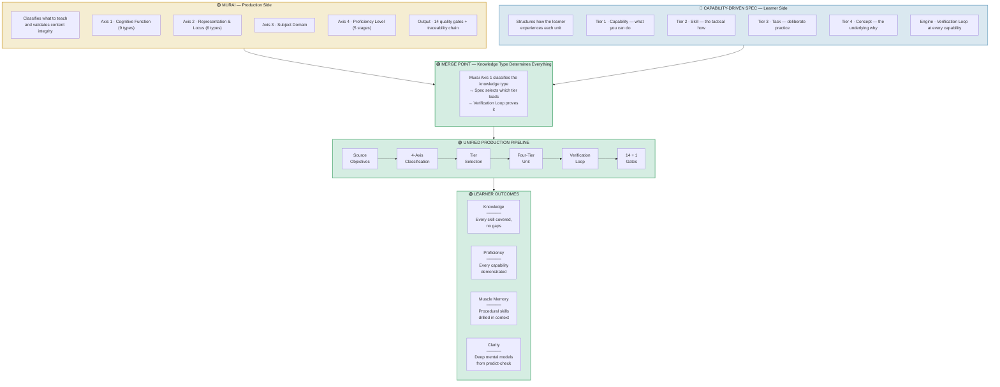

# Unified Framework: Murai + Capability-Driven Learning

*How the production engine and the learner experience merge at the knowledge type*

---

## System Architecture

---

## Knowledge Type Mapping (The Merge Table)

This is the central mechanism. Murai classifies what kind of knowledge each topic is, and that classification determines which tier leads the learner experience and which verification pattern proves competence.

| Murai Classifies | Spec Structures | Verification Pattern | Learner Outcome |
|---|---|---|---|
| **Declarative** (facts, rules) | Concept tier primary | Recall check | Knowledge |
| **Procedural** (methods) | Task tier primary | Command check | Muscle memory |
| **Conceptual** (models) | Concept + Skill co-primary | Predict then confirm | Clarity |
| **Conditional** (when/where) | Capability tier primary | Scenario decision | Judgment |
| **Causal** (explain, predict) | Concept tier primary | Intentional failure | Troubleshooting |
| **Strategic** (plan, adapt) | Capability tier primary | Design review | Architecture |
| **Tacit** (judgment) | Task tier, varied contexts | Pattern recognition | Intuition |
| **Embedded** (in tools) | Task tier primary | Tool output check | Proficiency |

> *Murai's Axis 1 (cognitive function) selects which tier leads. The Spec structures the unit. The Loop proves it.*

---

## Quality Gates (14 existing + 1 new)

| # | Gate | Source |
|---|---|---|
| 1 | teaching_substrate | Murai |
| 2 | source_objective | Murai |
| 3 | raw_provenance | Murai |
| 4 | schema | Murai |
| 5 | traceability | Murai |
| 6 | factual_verification | Murai |
| 7 | review_evidence | Murai |
| 8 | coverage | Murai |
| 9 | distribution | Murai |
| 10 | approved_output | Murai |
| 11 | cost | Murai |
| 12 | iteration | Murai |
| 13 | automation_tail | Murai |
| 14 | human_resolution | Murai |
| **15** | **tier_completeness** | **NEW — Unified** |

> *Gate 15: Every topic must produce a complete Four-Tier unit with a Verification Loop matching the dominant knowledge type.*

---

## Legend

- **Ochre / Yellow** — Murai: production and validation
- **Blue** — Capability-Driven Spec: learner structure
- **Green** — Unified: where both systems merge
